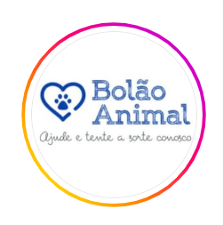

## Jackpot game 🍀

  

# 🎰 Jackpot do Bolão Animal

This is a simple game I developed for our betting group. The game was developed in two parts: frontend and backend. For the html frontend, I used a lot of AI (such as ChatGPT and Grok) help 🤪. For the backend, I basically used python. We deployed it both on github and render so that we could host it and have the game online for anyone with the link to play ▶. Basically, the person accesses the link, adds their e-mail (we only use the e-mail to receive a message with the date and time of the winner) and clicks on play 🎮, the numbers are drawn randomly between 1 and 5 (which results in a probability of 1 to 125 of winning 🏆), if the 3 numbers are the same the player wins the jackpot and wins a special bet for some lottery 🎁

## 🚀 Demo Rápida
[Jogue Agora!](https://seu-jogo.onrender.com) – Teste grátis com 5 tentativas diárias!

## 🚀 Demo Rápida
[Jogue Agora!](https://jackpot-k8n0.onrender.com/))

⭐ Star se curtiu! Jogue e compartilhe com os amigos. #BolaoAnimal #PythonGames

## 📄 Licença
MIT License – use livremente, mas cite o autor! 🐾
